# Maven学习

## 1. Maven是什么？

官方定义：Maven是一个**项目管理工具**，它包含了一个项目对象模型 (POM，Project Object Model)，一组标准集合，一个项目生命周期(Project Lifecycle)，一个依赖管理系统(Dependency Management System)，和用来运行定义在生命周期阶段(phase)中插件(plugin)目标(goal)的逻辑。

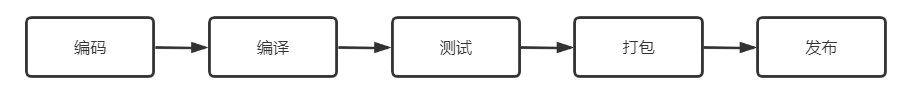

无论是java项目还是C++项目，一般都会经历编码、编译、测试、打包和发布等一系列构建过程。对于文件比较少我们可以手动去做这些事情，但是当工程越来越大，文件越来越多，整个手动构建过程就具有挑战性了。对于C/C++工程，我们可以通过编写Makefile文件使用make工具进行自动化构建。对于Java工程，早期通过编写build.xml文件，使用Ant工具进行自动化构建，Ant思想和make类似，但是Ant有一个致命的缺点，就是不能管理依赖，一个工程要使用很多第三方工具，不同的工具，不同的版本。每次打包都要自己手动去把正确的版本拷到lib下面去，这个工作既枯燥还特别容易出错。为了解决这个问题，maven闪亮登场。

Maven提出将所有的依赖都放在仓库中，每个依赖都有一个唯一的坐标GAV（GroupId, ArtifactId,Version），Maven可以根据GAV从仓库中找到指定的依赖。当存在依赖冲突时（version不同），maven通过依赖树自动的解决冲突。maven定义了三种生命周期（clean，defaut，site）进行项目构建，我们可以通过配置插件和目标将其绑定在生命周期的不同阶段中，实现个性化构建。

Maven的核心内容包含：项目坐标、项目依赖、生命周期、插件和目标。

## 2. 项目坐标

项目坐标定义了项目的唯一的位置，我们可以通过坐标找到相应的依赖。坐标由GroupId、ArtifactId和Verison构成。

* GroupId: 组织或公司逆域名+项目名，（一个公司有很多个产品项目） eg: com.huawei.esight
* artifactId: 模块名
* version: 版本号

如：pom.xml

```xml
<?xml version="1.0" encoding="UTF-8"?>
<project xmlns="http://maven.apache.org/POM/4.0.0"
         xmlns:xsi="http://www.w3.org/2001/XMLSchema-instance"
         xsi:schemaLocation="http://maven.apache.org/POM/4.0.0 http://maven.apache.org/xsd/maven-4.0.0.xsd">
    <modelVersion>4.0.0</modelVersion>

    <groupId>com.example.maven</groupId>
    <artifactId>model-parent</artifactId>
    <version>1.0-SNAPSHOT</version>

</project>
```

安装：

```bash
mvn install
```

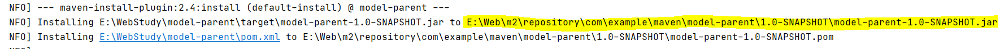

以打包方式为 `jar`为例，项目安装时，该项目将会存在 `本地仓库地址/com/example/maven/model-parent/1.0-SNAPSHOT/model-parent-1.0-SNAPSHOT.jar`中。

## 3. 项目依赖

### 3.1 项目依赖

通过在 `<dependency>`标签中使用依赖的GAV来声明项目需要的指定依赖。比如model-parent项目依赖log4j，则pom配置如下：

```xml
<project ...>
    ....
    <dependencies>
        <dependency>
            <groupId>log4j</groupId>
            <artifactId>log4j</artifactId>
            <version>1.2.17</version>
        </dependency>
    </dependencies>
</project>
```

在声明项目依赖时，会存在依赖范围（Scope）的问题，通过`<scope>`标签来定义。主要有四种scope：compile、provided、runtime和test

1. compile：

   * 编译时使用该依赖，运行时也使用该依赖。

   * 对主程序来说依赖有效

   * 对测试程序来说依赖有效

   * 参与打包，部署时需要

例子：

pom.xml中配置log4j的scope为compile

```xml
<dependency>
    <groupId>log4j</groupId>
    <artifactId>log4j</artifactId>
    <version>1.2.17</version>
    <scope>compile</scope>
</dependency>
```

主程序：src/main/java/App.java

```java
package com.example.maven;
import org.apache.log4j.Logger;
public class App 
{
    private static Logger logger = Logger.getLogger(String.valueOf(App.class));
    public static void main( String[] args ) {
        System.out.println( "Hello World!" );
        logger.info("This is a info message from App");
    }
}
```

测试程序：src/test/java/AppTest.java

```java
package com.example.maven;
import static org.junit.Assert.assertTrue;
import org.apache.log4j.Logger;
import org.junit.Test;

public class AppTest 
{
    private static Logger logger=Logger.getLogger(AppTest.class);
    @Test
    public void shouldAnswerWithTrue() {
        assertTrue( true );
        logger.info("This is a info message from AppTest");
    }
}
```

主程序和测试程序都可以使用loj4j。

2. test:

   * 编译时使用依赖，运行时不使用依赖

   * 对主程序来说依赖无效

   * 对测试程序来说依赖有效

   * 不参与打包，部署时不需要

例子：

pom.xml中配置junit的scope为test

```xml
<dependency>
    <groupId>junit</groupId>
    <artifactId>junit</artifactId>
    <version>4.11</version>
    <scope>test</scope>
</dependency>
```

则在主程序中我们不能使用junit,而只有在测试程序中可以使用junit。

3. provided:

   * 主要针对web工程 servelt-api.jar

   * 编译时使用依赖，运行时不使用依赖

   * 对主程序和测试程序都有效

   * 不参与打包，部署时不需要

4. runtime:

   * 编译时不使用依赖，运行时使用依赖

   * 参与打包，部署时需要

### 3.2 多模块项目

对一个复杂的项目，一般会建立一个父项目，打包形式为pom，子模块的pom和父项目的pom会合并得到有效的pom。子模块有效的pom会继承父项目的pom中除artifactId的所有元素，子项目还可以覆盖掉父项目的pom配置。

比如有如图所示的多模块结构：

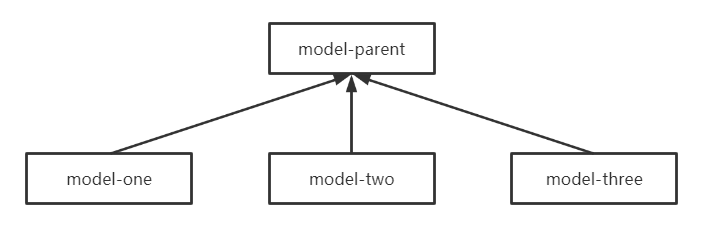


model-one、model-two和model-three都是model-parent父项目的子模块。

* model-parent的pom.xml:

```xml
<?xml version="1.0" encoding="UTF-8"?>

<project xmlns="http://maven.apache.org/POM/4.0.0" xmlns:xsi="http://www.w3.org/2001/XMLSchema-instance"
  xsi:schemaLocation="http://maven.apache.org/POM/4.0.0 http://maven.apache.org/xsd/maven-4.0.0.xsd">
  <modelVersion>4.0.0</modelVersion>

  <groupId>com.example.maven</groupId>
  <artifactId>model-parent</artifactId>
  <version>1.0-SNAPSHOT</version>
  <modules>
    <module>model-one</module>
    <module>model-two</module>
    <module>model-three</module>
  </modules>
  <packaging>pom</packaging>

  <dependencies>
    <dependency>
      <groupId>junit</groupId>
      <artifactId>junit</artifactId>
      <version>4.11</version>
      <scope>test</scope>
    </dependency>
    <dependency>
      <groupId>log4j</groupId>
      <artifactId>log4j</artifactId>
      <version>1.2.17</version>
    </dependency>
    <dependency>
      <groupId>javax.servlet</groupId>
      <artifactId>servlet-api</artifactId>
      <version>2.5</version>
      <scope>provided</scope>
    </dependency>
  </dependencies>
</project>
```

model-parent的依赖为：

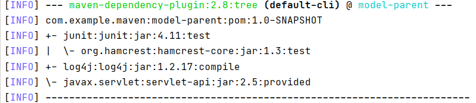

* model-one的pom.xml:

```xml
<project xmlns="http://maven.apache.org/POM/4.0.0" xmlns:xsi="http://www.w3.org/2001/XMLSchema-instance"
  xsi:schemaLocation="http://maven.apache.org/POM/4.0.0 http://maven.apache.org/xsd/maven-4.0.0.xsd">
  <modelVersion>4.0.0</modelVersion>

  <parent>
    <groupId>com.example.maven</groupId>
    <artifactId>model-parent</artifactId>
    <version>1.0-SNAPSHOT</version>
  </parent>

  <artifactId>model-one</artifactId>
  <version>1.0-SNAPSHOT</version>

</project>
```

model-one的pom依赖为：

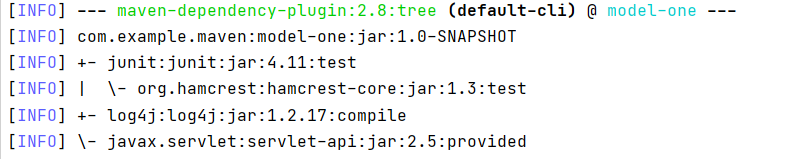

model-ome的依赖来model-parent一样，即它继承了mode-parent的依赖。

* model-two的pom.xml：

```xml
<project xmlns="http://maven.apache.org/POM/4.0.0" xmlns:xsi="http://www.w3.org/2001/XMLSchema-instance"
  xsi:schemaLocation="http://maven.apache.org/POM/4.0.0 http://maven.apache.org/xsd/maven-4.0.0.xsd">
  <modelVersion>4.0.0</modelVersion>

  <parent>
    <groupId>com.example.maven</groupId>
    <artifactId>model-parent</artifactId>
    <version>1.0-SNAPSHOT</version>
  </parent>


  <artifactId>model-two</artifactId>
  <version>1.0-SNAPSHOT</version>

  <dependencies>
    <dependency>
      <groupId>commons-io</groupId>
      <artifactId>commons-io</artifactId>
      <version>2.8.0</version>
    </dependency>
  </dependencies>
</project>
```

它增加了commons-io的依赖：

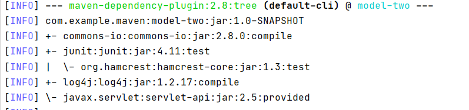

* model-three的pom.xml：

```xml
<?xml version="1.0" encoding="UTF-8"?>

<project xmlns="http://maven.apache.org/POM/4.0.0" xmlns:xsi="http://www.w3.org/2001/XMLSchema-instance"
  xsi:schemaLocation="http://maven.apache.org/POM/4.0.0 http://maven.apache.org/xsd/maven-4.0.0.xsd">
  <modelVersion>4.0.0</modelVersion>

  <parent>
    <groupId>com.example.maven</groupId>
    <artifactId>model-parent</artifactId>
    <version>1.0-SNAPSHOT</version>
  </parent>

  <artifactId>model-three</artifactId>
  <version>1.0-SNAPSHOT</version>

  <dependencies>
    <dependency>
      <groupId>junit</groupId>
      <artifactId>junit</artifactId>
      <version>4.12</version>
      <scope>test</scope>
    </dependency>
  </dependencies>

</project>
```

覆盖掉了父项目中指定的junit依赖，由4.11改为4.12版本。

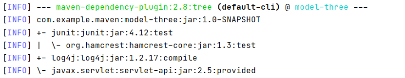

### 3.3 依赖冲突的解决

由于依赖的传递性，可能存在一个项目的依赖具有不同版本，这就会造成依赖冲突的问题，项目不知道到底依赖的是哪个版本。maven使用依赖树来解决冲突。

根据依赖树结构有三种情况来解决冲突：

* 当不同版本的依赖位于第一级，即都是直接依赖时，选择最后声明的依赖作为有效的依赖。

  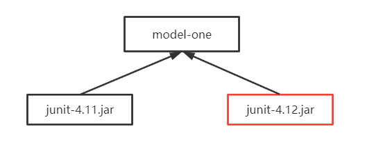

model-one的pom.xml

```xml
<?xml version="1.0" encoding="UTF-8"?>

<project xmlns="http://maven.apache.org/POM/4.0.0" xmlns:xsi="http://www.w3.org/2001/XMLSchema-instance"
  xsi:schemaLocation="http://maven.apache.org/POM/4.0.0 http://maven.apache.org/xsd/maven-4.0.0.xsd">
  <modelVersion>4.0.0</modelVersion>

  <parent>
    <groupId>com.example.maven</groupId>
    <artifactId>model-parent</artifactId>
    <version>1.0-SNAPSHOT</version>
  </parent>

  <artifactId>model-one</artifactId>
  <version>1.0-SNAPSHOT</version>

  <dependencies>
    <dependency>
      <groupId>junit</groupId>
      <artifactId>junit</artifactId>
      <version>4.11</version>
      <scope>test</scope>
    </dependency>
    <dependency>
      <groupId>junit</groupId>
      <artifactId>junit</artifactId>
      <version>4.12</version>
      <scope>test</scope>
    </dependency>
  </dependencies>
</project>
```

如model-one直接声明了两个版本的junit，其中4.12版本最后声明，则model-one实际依赖的时4.12版本。

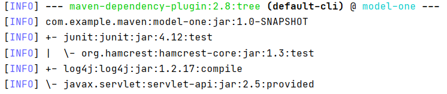

* 当不同版本的依赖不位于第一级，但是位于相同级，则实际依赖的是先声明的依赖。

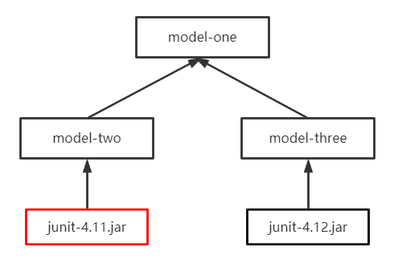

model-one的pom.xml：

```xml
<dependencies>
    <dependency>
      <groupId>com.example.maven</groupId>
      <artifactId>model-two</artifactId>
      <version>1.0-SNAPSHOT</version>
    </dependency>
    <dependency>
      <groupId>com.example.maven</groupId>
      <artifactId>model-three</artifactId>
      <version>1.0-SNAPSHOT</version>
    </dependency>
</dependencies>
```

model-two的pom.xml:

```xml
<dependencies>
    <dependency>
      <groupId>junit</groupId>
      <artifactId>junit</artifactId>
      <version>4.11</version>
      <scope>test</scope>
    </dependency>
</dependencies>
```

model-three的pom.xml

```xml
<dependencies>
    <dependency>
      <groupId>junit</groupId>
      <artifactId>junit</artifactId>
      <version>4.12</version>
      <scope>test</scope>
    </dependency>
</dependencies>
```

model-one依赖的是juint-4.11.jar

* 当不同版本的依赖为于不同级，则实际依赖的路径最近的那个版本。

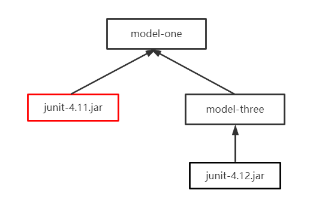

model-one 的pom.xml

```xml
<dependencies>
    <dependency>
      <groupId>junit</groupId>
      <artifactId>junit</artifactId>
      <version>4.11</version>
      <scope>test</scope>
    </dependency>
    <dependency>
      <groupId>com.example.maven</groupId>
      <artifactId>model-three</artifactId>
      <version>1.0-SNAPSHOT</version>
    </dependency>
</dependencies>
```

model-three的pom.xml

```xml
<dependencies>
    <dependency>
      <groupId>junit</groupId>
      <artifactId>junit</artifactId>
      <version>4.12</version>
      <scope>test</scope>
    </dependency>
</dependencies>
```

model-one 选择路径最近的junit版本，即junit-4.11.jar

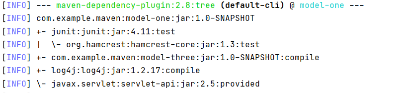

## 4. 生命周期

maven使用生命周期来进行自动化构建，maven主要有三种生命周期：clean, default和site。生命周期由不同的阶段按照顺序构成，而每个阶段由一个或多个插件的目标顺序构成。

* clean生命周期中的阶段：

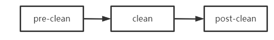

* default生命周期中的阶段：

  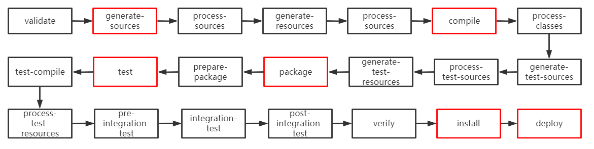

* site生命阶段中的阶段

  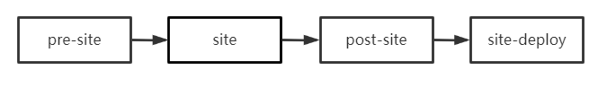

当我们执行某个生命周期中的某一阶段时，它将会从该阶段所属的生命周期的最开始阶段进行构建。如执行：

```
mvn compile
```

则会从default生命周期的validate开始构建，直到compile阶段。

对生命周期中的每个阶段，我们可以配置或者绑定需要的插件，执行自定义的构建。

